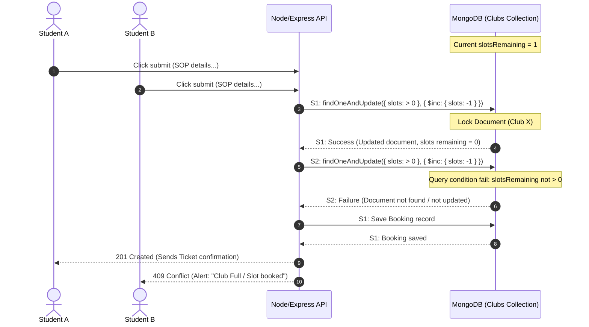

# MongoDB Slot Management & Concurrency Architecture Guide

In a high-traffic environment (similar to BookMyShow), managing inventory slots (such as tickets or membership capacity) requires strict concurrency controls. If two students submit a registration form for the last available slot at the exact same millisecond, the database must guarantee that only one booking succeeds while the other is rejected with a conflict error.

This guide details how to implement this system using **MongoDB** in a Node.js/Express backend environment.

---

## 1. MongoDB Schema Design

For a club slot booking system, we define two collections: `clubs` (stores metadata and remaining capacity) and `bookings` (stores individual registrations).

### A. Clubs Collection Schema
```javascript
// Models/Club.js (Mongoose Schema)
const mongoose = require('mongoose');

const clubSchema = new mongoose.Schema({
  name: { type: String, required: true, unique: true },
  category: { type: String, required: true },
  icon: { type: String },
  accentColor: { type: String },
  tagline: { type: String },
  description: { type: String },
  maxCapacity: { type: Number, default: 80 },
  slotsRemaining: { type: Number, default: 80, min: 0 } // Constraint: cannot go below 0
}, { timestamps: true });

// Indexing for high-speed lookups
clubSchema.index({ name: 1 });
clubSchema.index({ category: 1 });

module.exports = mongoose.model('Club', clubSchema);
```

### B. Bookings Collection Schema
```javascript
// Models/Booking.js (Mongoose Schema)
const mongoose = require('mongoose');

const bookingSchema = new mongoose.Schema({
  clubId: { type: mongoose.Schema.Types.ObjectId, ref: 'Club', required: true },
  studentName: { type: String, required: true },
  studentId: { type: String, required: true },
  email: { type: String, required: true },
  phone: { type: String, required: true },
  yearOfStudy: { 
    type: String, 
    enum: ['First Year', 'Second Year', 'Third Year', 'Fourth Year'], 
    required: true 
  },
  department: { type: String, required: true },
  whyJoin: { type: String, required: true },
  skills: { type: String },
  bookingId: { type: String, required: true, unique: true },
  bookingTime: { type: Date, default: Date.now }
});

// Compound unique index to prevent a student from booking the same club multiple times
bookingSchema.index({ clubId: 1, studentId: 1 }, { unique: true });

module.exports = mongoose.model('Booking', bookingSchema);
```

---

## 2. Handling Race Conditions (Concurrency Control)

In MongoDB, we have two primary methods to prevent double-booking: **Atomic Conditional Updates** (highly recommended for performance) and **ACID Sessions/Transactions** (recommended for absolute data consistency).

### Method A: Atomic Conditional Updates (Recommended)
This approach leverages MongoDB's write lock on single documents. We execute an update command that decrements the slot count **only if** the slot count is greater than zero.

```javascript
// Controller/bookingController.js
const Club = require('../Models/Club');
const Booking = require('../Models/Booking');
const { v4: uuidv4 } = require('uuid');

exports.createBookingAtomic = async (req, res) => {
  const { clubId, studentName, studentId, email, phone, yearOfStudy, department, whyJoin, skills } = req.body;

  try {
    // 1. Atomically attempt to decrement the slotsRemaining by 1
    // CRITICAL: The filter query check { slotsRemaining: { $gt: 0 } } ensures 
    // that the document is only updated if there is at least one slot left.
    const updatedClub = await Club.findOneAndUpdate(
      { 
        _id: clubId, 
        slotsRemaining: { $gt: 0 } 
      },
      { 
        $inc: { slotsRemaining: -1 } 
      },
      { 
        new: true, // returns the updated document
        runValidators: true 
      }
    );

    // If no document matched the filter, it means slotsRemaining was already 0
    if (!updatedClub) {
      return res.status(409).json({
        success: false,
        error: 'Club Full',
        message: 'Transaction Conflict: The last slot has just been reserved by another student.'
      });
    }

    // 2. Since slot reservation succeeded, create the booking document
    const uniqueBookingCode = `CS-${clubId.toString().slice(-4).toUpperCase()}-${Math.floor(1000 + Math.random() * 9000)}`;
    
    const newBooking = new Booking({
      clubId,
      studentName,
      studentId,
      email,
      phone,
      yearOfStudy,
      department,
      whyJoin,
      skills,
      bookingId: uniqueBookingCode
    });

    await newBooking.save();

    return res.status(201).json({
      success: true,
      booking: newBooking,
      remainingSlots: updatedClub.slotsRemaining
    });

  } catch (err) {
    // Handle unique index violations (e.g. if the student already registered for this club)
    if (err.code === 11000) {
      // Revert the slot reservation count since the save failed!
      await Club.updateOne({ _id: clubId }, { $inc: { slotsRemaining: 1 } });
      
      return res.status(400).json({
        success: false,
        error: 'Duplicate Registration',
        message: 'You have already registered for this club.'
      });
    }

    return res.status(500).json({ success: false, error: err.message });
  }
};
```

### Method B: MongoDB ACID Transactions (Multi-Document Rollbacks)
If you are running a replica set or sharded cluster (MongoDB 4.0+), you can use multi-document transactions to ensure that if any step of the booking fails, all changes are rolled back.

```javascript
// Controller/bookingController.js using Sessions
const mongoose = require('mongoose');
const Club = require('../Models/Club');
const Booking = require('../Models/Booking');

exports.createBookingTransaction = async (req, res) => {
  const session = await mongoose.startSession();
  session.startTransaction();

  try {
    const { clubId, studentName, studentId, email, phone, yearOfStudy, department, whyJoin, skills } = req.body;

    // 1. Fetch club and check slots within the transaction session (pessimistic lock check)
    const club = await Club.findById(clubId).session(session);
    if (!club || club.slotsRemaining <= 0) {
      throw new Error('CLUB_FULL');
    }

    // 2. Decrement slots count
    club.slotsRemaining -= 1;
    await club.save({ session });

    // 3. Create booking details
    const uniqueBookingCode = `CS-${clubId.toString().slice(-4).toUpperCase()}-${Math.floor(1000 + Math.random() * 9000)}`;
    const newBooking = new Booking({
      clubId,
      studentName,
      studentId,
      email,
      phone,
      yearOfStudy,
      department,
      whyJoin,
      skills,
      bookingId: uniqueBookingCode
    });

    await newBooking.save({ session });

    // Commit all changes to MongoDB collections atomically
    await session.commitTransaction();
    session.endSession();

    return res.status(201).json({
      success: true,
      booking: newBooking
    });

  } catch (err) {
    // Abort transaction - rolls back the slot decrement and booking document creation
    await session.abortTransaction();
    session.endSession();

    if (err.message === 'CLUB_FULL') {
      return res.status(409).json({
        success: false,
        error: 'Club Full',
        message: 'Slots are fully occupied. Registration closed.'
      });
    }

    if (err.code === 11000) {
      return res.status(400).json({
        success: false,
        error: 'Duplicate Registration',
        message: 'You have already registered for this club.'
      });
    }

    return res.status(500).json({ success: false, error: err.message });
  }
};
```

---

## 3. Concurrency Workflows

The diagram below illustrates how concurrent reservation attempts are handled by MongoDB using the **Atomic Conditional Update** method.



---

## 4. Key Performance Strategies

1. **Write Optimizations**:
   Use **Method A (Atomic Updates)** over transactions where possible. Transactions introduce overhead (two-phase commits, replication log locks) which can degrade performance in high-throughput ticketing systems.
2. **Preventing Double Bookings (Idempotency)**:
   Adding a unique constraint index on `{ clubId: 1, studentId: 1 }` guarantees that even if a student hits the submit button multiple times rapidly (or double clicks), MongoDB rejects the second request.
3. **Mongoose Virtuals**:
   Use virtual properties to compute availability percentage on the fly rather than keeping multiple redundant fields in sync.
